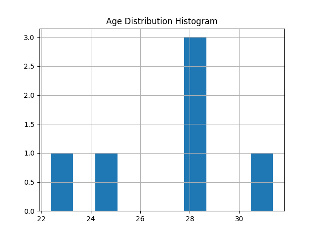
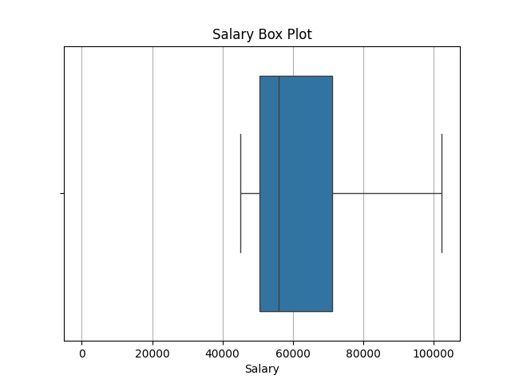

## Exploratory Data Analysis (EDA) of Polluted Data

A comprehensive EDA pipeline that cleans and analyzes a synthetically polluted dataset, demonstrating common data quality issues and their solutions.

### Features

- Handles missing values, outliers, and inconsistent data types
- Visualizes distributions and relationships
- Performs feature encoding and scaling
- Complete logging of all transformation steps
- Outputs cleaned dataset and visualizations

### Data Quality Issues Handled


| Issue Type          | Examples in Dataset               | Solution Applied                       |
|---------------------|-----------------------------------|----------------------------------------|
| Missing Values      | NaN in Age, Salary, Department    | Median imputation, fill with 'Unknown' |
| Invalid Data Types  | String 'thirty' in Age column     | Coercion to numeric                    |
| Outliers            | Age=150, Salary=9,999,999         | IQR-based capping                      |
| Inconsistent Casing | 'IT' vs 'it' in Department        | Case standardization                   |
| Duplicate Records   | ID=2 appears twice                | Deduplication                          |

### Sample Visualizations

### Age Distribution


### Salary Distribution


### Heat Map of Numerical data types


### Technical Implementation

```python
# Key cleaning steps example:
df['Age'] = pd.to_numeric(df['Age'], errors='coerce')  # Handle string values
df['Age'] = df['Age'].fillna(df['Age'].median())       # Impute missing values
```

### Outlier handling using IQR
Q1 = df['Salary'].quantile(0.25)

Q3 = df['Salary'].quantile(0.75)

IQR = Q3 - Q1

upper_bound = Q3 + 1.5*IQR

df.loc[df['Salary'] > upper_bound, 'Salary'] = upper_bound

### File Structure

Exploratory-Analysis-of-Polluted-Data/
├── eda_step_by_step.py       # Main EDA pipeline
├── utils.py                  # Helper functions
├── logging_config.py         # Logging setup
├── polluted_dataset.csv      # Raw polluted data
├── cleaned_polluted_data.csv # Processed output
├── age_histogram.png         # Visualization
└── salary_box_plot.png       # Visualization

### Getting Started

- Clone the repository

```bash
git clone https://github.com/yourusername/Exploratory-Analysis-of-Polluted-Data.git
```
- Install requirements
```bash
pip install pandas numpy matplotlib seaborn scikit-learn
```
- Run the python script
```bash
python eda_step_by_step.py
```


### Logging Output 

<pre>

Logging initialized. Logs will be saved to: /home/vijay/my_github_projects/Exploratory-Analysis-of-Polluted-Data/log_file/eda_polluted_dataset.log

1. Create a polluted dataset

2. Polluted Dataset as whole::

   ID     Age     Salary Department   Join_Date
0   1      25    50000.0         HR  2020-01-15
1   2      -5    60000.0         IT  15/01/2021
2   2      32        NaN         it  2022-13-01
3   3     NaN    75000.0      Sales         NaN
4   4     150  9999999.0         HR  2021-05-10
5   5      28    45000.0        NaN  2020-12-01
6   6  thirty    52000.0  Marketing  2023-02-30

3. Display few dataset::

   ID  Age     Salary Department   Join_Date
0   1   25    50000.0         HR  2020-01-15
1   2   -5    60000.0         IT  15/01/2021
2   2   32        NaN         it  2022-13-01
3   3  NaN    75000.0      Sales         NaN
4   4  150  9999999.0         HR  2021-05-10

4. Dataset information::

<class 'pandas.core.frame.DataFrame'>
RangeIndex: 7 entries, 0 to 6
Data columns (total 5 columns):
 #   Column      Non-Null Count  Dtype  
---  ------      --------------  -----  
 0   ID          7 non-null      int64  
 1   Age         6 non-null      object 
 2   Salary      6 non-null      float64
 3   Department  6 non-null      object 
 4   Join_Date   6 non-null      object 
dtypes: float64(1), int64(1), object(3)
memory usage: 412.0+ bytes


**Note** Shows Age as object (due to 'thirty'), Salary/Department/Join_Date with NaN

5. Check for missing values::

ID            0
Age           1
Salary        1
Department    1
Join_Date     1
dtype: int64

6. Handling missing values::

   ID     Age     Salary Department   Join_Date
0   1      25    50000.0         HR  2020-01-15
1   2      -5    60000.0         IT  15/01/2021
2   2      32    56000.0         it  2022-13-01
3   3     NaN    75000.0      Sales     Unknown
4   4     150  9999999.0         HR  2021-05-10
5   5      28    45000.0    Unknown  2020-12-01
6   6  thirty    52000.0  Marketing  2023-02-30

7. Check data types and convert if necessary::

After Handling missing values::

   ID    Age     Salary Department   Join_Date
0   1   25.0    50000.0         HR  2020-01-15
1   2   -5.0    60000.0         IT  15/01/2021
2   2   32.0    56000.0         it  2022-13-01
3   3   28.0    75000.0      Sales     Unknown
4   4  150.0  9999999.0         HR  2021-05-10
5   5   28.0    45000.0    Unknown  2020-12-01
6   6   28.0    52000.0  Marketing  2023-02-30

8. Explore summary statistics::

             ID         Age        Salary
count  7.000000    7.000000  7.000000e+00
mean   3.285714   40.857143  1.476857e+06
std    1.799471   49.734055  3.758365e+06
min    1.000000   -5.000000  4.500000e+04
25%    2.000000   26.500000  5.100000e+04
50%    3.000000   28.000000  5.600000e+04
75%    4.500000   30.000000  6.750000e+04
max    6.000000  150.000000  9.999999e+06

9. Identify and handle duplicates::

Check full row duplicates: 0

   ID    Age     Salary Department   Join_Date
0   1   25.0    50000.0         HR  2020-01-15
1   2   -5.0    60000.0         IT  15/01/2021
3   3   28.0    75000.0      Sales     Unknown
4   4  150.0  9999999.0         HR  2021-05-10
5   5   28.0    45000.0    Unknown  2020-12-01
6   6   28.0    52000.0  Marketing  2023-02-30

IQR for Age::

Age - Q1 (25th percentile): 25.75

Age - Q3 (75th percentile): 28.0

Age - IQR: 2.25

Age - Lower Bound: 22.375

Age - Upper Bound: 31.375

Outliers in Age::

0    False
1     True
3    False
4     True
5    False
6    False

Salary - Q1 (25th percentile): 50500.0

Salary - Q3 (75th percentile): 71250.0

Salary - IQR: 20750.0

Salary - Lower Bound: 19375.0

Salary - Upper Bound: 102375.0

Outliers in Salary:

   ID     Age     Salary Department   Join_Date
4   4  31.375  9999999.0         HR  2021-05-10

DataFrame after handling outliers:

   ID     Age    Salary Department   Join_Date
0   1  25.000   50000.0         HR  2020-01-15
1   2  22.375   60000.0         IT  15/01/2021
3   3  28.000   75000.0      Sales     Unknown
4   4  31.375  102375.0         HR  2021-05-10
5   5  28.000   45000.0    Unknown  2020-12-01
6   6  28.000   52000.0  Marketing  2023-02-30

11. Handle outliers::

DataFrame after handling outliers:

   ID     Age    Salary Department   Join_Date
0   1  25.000   50000.0         HR  2020-01-15
1   2  22.375   60000.0         IT  15/01/2021
3   3  28.000   75000.0      Sales     Unknown
4   4  31.375  102375.0         HR  2021-05-10
5   5  28.000   45000.0    Unknown  2020-12-01
6   6  28.000   52000.0  Marketing  2023-02-30

12. Data Visualization::

Age Distribution Hsitogram saved

Salary Box Plot saved

13. Explore relationships between variables::

              ID       Age    Salary
ID      1.000000  0.611715 -0.018959
Age     0.611715  1.000000  0.587010
Salary -0.018959  0.587010  1.000000

Heat Map graph saved

14. Perform feature encoding::

   ID     Age    Salary   Join_Date  Dept_hr  Dept_it  Dept_marketing  Dept_sales  Dept_unknown
0   1  25.000   50000.0  2020-01-15        1        0               0           0             0
1   2  22.375   60000.0  15/01/2021        0        1               0           0             0
3   3  28.000   75000.0     Unknown        0        0               0           1             0
4   4  31.375  102375.0  2021-05-10        1        0               0           0             0
5   5  28.000   45000.0  2020-12-01        0        0               0           0             1
6   6  28.000   52000.0  2023-02-30        0        0               1           0             0

15. Scale or normalize data if required::

   ID       Age    Salary   Join_Date  Dept_hr  Dept_it  Dept_marketing  Dept_sales  Dept_unknown
0   1 -0.755742 -0.716596  2020-01-15        1        0               0           0             0
1   2 -1.689306 -0.207017  15/01/2021        0        1               0           0             0
3   3  0.311188  0.557352     Unknown        0        0               0           1             0
4   4  1.511484  1.952325  2021-05-10        1        0               0           0             0
5   5  0.311188 -0.971385  2020-12-01        0        0               0           0             1
6   6  0.311188 -0.614680  2023-02-30        0        0               1           0             0

16. Save the cleaned dataset::

Cleaned Dataset:

   ID       Age    Salary   Join_Date  Dept_hr  Dept_it  Dept_marketing  Dept_sales  Dept_unknown
0   1 -0.755742 -0.716596  2020-01-15        1        0               0           0             0
1   2 -1.689306 -0.207017  15/01/2021        0        1               0           0             0
3   3  0.311188  0.557352     Unknown        0        0               0           1             0
4   4  1.511484  1.952325  2021-05-10        1        0               0           0             0
5   5  0.311188 -0.971385  2020-12-01        0        0               0           0             1
6   6  0.311188 -0.614680  2023-02-30        0        0               1           0             0

--Note-- The dataset is now clearned: No duplicates, no missing values, outliers capped, consistent types and scaled features.

</pre>

### License

This project is licensed under the GNU General Public License v3.0 (GPL-3.0). 
